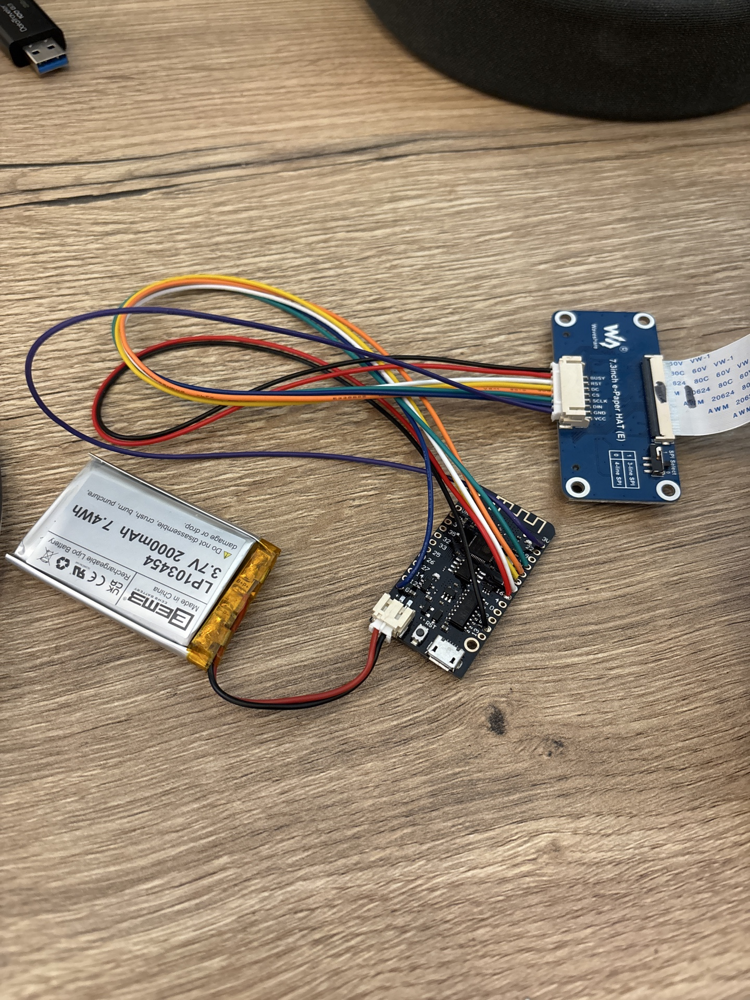

# spectra6_photoframe

This repo contains everything needed to drive a Waveshare 7.3" e-Paper display specifically for use in a photo frame using either:

- a **Raspberry Pi** (Python, Waveshare HAT connected directly to the Pi GPIO header), or
- an **ESP32** client (Arduino) that downloads a pre-processed image over WiFi.

Image processing (resize/crop, palette reduction, dithering, and device-color mapping) is handled by a Node.js server.

## Repo layout

- `python/`
  - `epd_bmp.py`: Raspberry Pi script that fetches a BMP from the server and displays it.
  - `lib/waveshare_epd/`: Waveshare Python driver module used by the scripts.
- `server/`
  - Node.js + Docker image optimization server.
  - Important implementation file: `server/server/server.js`
- `esp32/`
  - Arduino sketch and supporting C++ code for the ESP32 client.

## Hardware

### Raspberry Pi (Python)

- Intended to run on a **Raspberry Pi**.
- Uses a **Waveshare e-Paper HAT** plugged directly onto the **GPIO header**.

### ESP32 (Arduino)

- Board used: **AZ-Delivery Lolin32 (ESP32-WROOM-32)**
- This board can be used with a battery (be sure to check the polarity)
- Wiring scheme (ESP32 pin numbers as used in firmware):

| Signal | ESP32 pin |
|---|---:|
| BUSY | 15 |
| RST | 16 |
| DC | 17 |
| CS | 5 |
| SCLK | 18 |
| DIN | 23 |
| GND | GND |
| VCC | 3V3 |



## Server: setup & start

The server runs in Docker and exposes HTTP endpoints to return e-paper-optimized images.

### Start (Docker, recommended)

```bash
cd server
./start.sh
```

This uses Docker Compose and starts the service on `http://localhost:3000`.

### Start/stop manually (Docker Compose)

```bash
cd server
docker compose up --build -d

docker compose logs -f

docker compose down
```

### Endpoints

- `GET /health` – health check JSON
- `GET /png` – optimized PNG (default target: 480×800)
- `GET /bmp` – optimized 24-bit BMP (default target: 480×800)
- `GET /esp32/image` – optimized 24-bit BMP for ESP32 (target: 800×480)
- `GET /esp32/frame` – packed 4bpp framebuffer for ESP32 (target: 800×480, recommended for ESP32-WROOM-32 without PSRAM)
- `GET /upload` – upload UI
- `POST /upload` – upload a new source image

### Configuration

Set these environment variables (see `server/docker-compose.yml`):

- `PORT` (default `3000`)
- `IMAGE_PATH` (default `/app/server/example.png` in Docker)
- `DEVICE_TYPE` (default `spectra6`)

## Uploading a new picture

### Option A: Web UI

Open:

- `http://<server-host>:3000/upload`

Upload a file (JPG/PNG/GIF/WebP/BMP). The server overwrites the configured `IMAGE_PATH` and subsequent `/bmp`, `/png`, and `/esp32/image` requests will use the new image.

### Option B: cURL

```bash
curl -F "image=@/absolute/path/to/photo.jpg" http://<server-host>:3000/upload
```

## Raspberry Pi: run the BMP script

### Prereqs (Pi)

- Enable SPI:
  - `sudo raspi-config` → **Interface Options** → **SPI** → Enable
- Install Python deps:

```bash
python3 -m pip install --upgrade pip
python3 -m pip install pillow requests
```

The Waveshare driver is included in this repo at `python/lib/waveshare_epd`.

### Run

```bash
python3 python/epd_bmp.py
```

Update the server URL in `python/epd_bmp.py` to point at your server (it currently fetches `http://10.0.1.57:3000/bmp`).

## ESP32: deploy the client

### 1) Install Arduino IDE

- Install Arduino IDE (2.x recommended).

### 2) Install ESP32 platform support

- Arduino IDE → **Preferences** → **Additional Boards Manager URLs**:
  - `https://raw.githubusercontent.com/espressif/arduino-esp32/gh-pages/package_esp32_index.json`
- Tools → **Board** → **Boards Manager** → install **“esp32 by Espressif Systems”**.

### 3) Install ArduinoJson

- Sketch → Include Library → Manage Libraries…
- Install **ArduinoJson** (v6.x) by Benoit Blanchon.

### 4) Build & flash

- Open the sketch: `esp32/esp32.ino`
- Select the board matching the Lolin32 (commonly **ESP32 Dev Module** or **WEMOS LOLIN32** in the Arduino ESP32 core).
- Select the correct serial port.
- Click **Upload**.

### 5) Configure runtime

The ESP32 downloads from the server’s ESP32 endpoint:

- `http://<server-host>:3000/esp32/image`
- The ESP32 creates a wifi access point with a captive portal which allows you to configure the wifi connection information and server address
- If the Epaper display shows a red color this means an error occurred


## Attribution

The image optimization pipeline (palette reduction, dithering, and device color mapping) is derived from the open-source project:

- https://github.com/Utzel-Butzel/epdoptimize

This repository includes/adapts that code for use in the HTTP server (and related tooling) to generate e-paper-friendly images.
